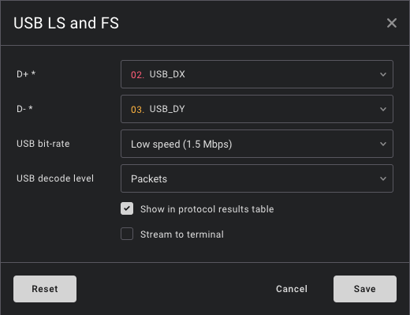
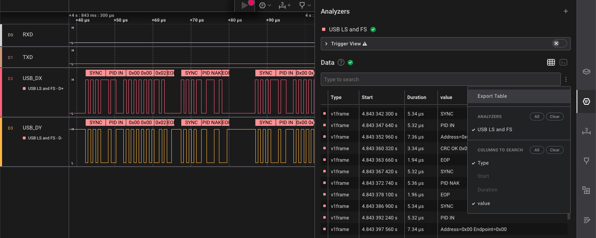
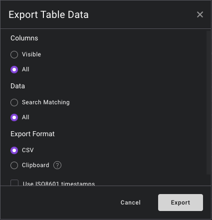
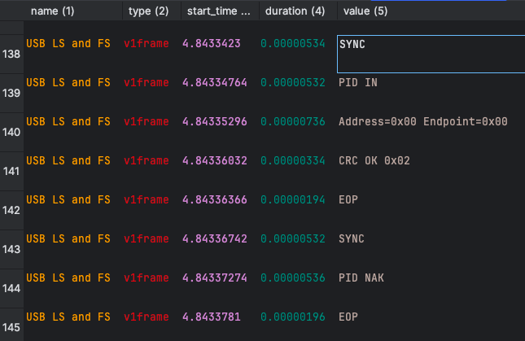
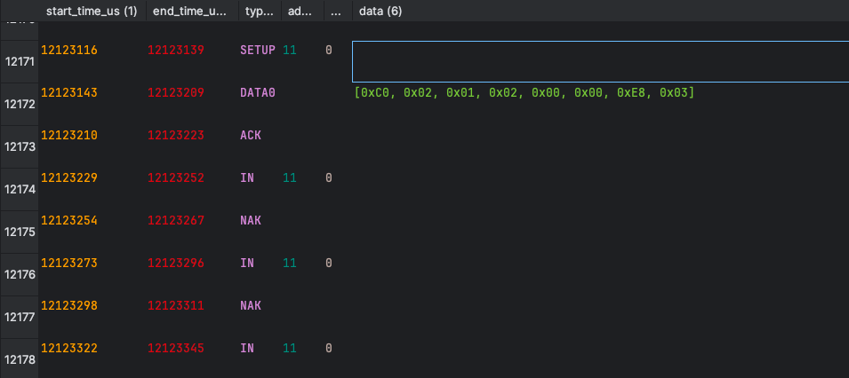
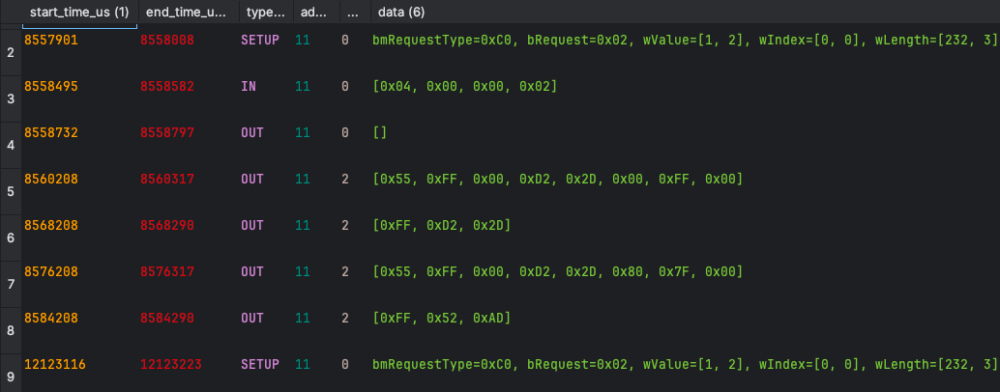

# UsbInsight - a high-level USB decoder

This repository provides a tool called **UsbInsight** - a _decoder_ - which parses CSV tables exported from USB HS/LS (i.e. high- or low-speed) traffic recorded with the [Saleae Logic 2 software](https://www.saleae.com/pages/downloads). Unfortunately, currently there's no support to directly write a USB [High-Level Analyzer (HLA)](https://support.saleae.com/extensions/high-level-analyzer-extensions) extension for Saleae Logic.

With the help of this tool, we can now work with USB traffic on _**USB packet** level_ and even _**USB transaction** level_ instead of having to deal with many, many _**USB packet fields**_ (e.g. SYNC, PID, CRC, EOP) as `v1frame`s. Great that Salea does all the **USB signal decoding** and already provides the **USB packet fields** - **but** getting all this data gets especially tedious when there are a lot of "irrelevant" _Reset_ and _Keep alive_ signals for USB low-speed or _start of frame (SOF) packets_ for USB full-speed.

Sometimes you cannot to see the wood for the trees. So this tool is meant to help you because "more is less": running this script will output another CSV file with data on a _higher USB analysis level_ and have way fewer lines than the input file. The result: fewer lines to be inspected and analyzed manually (or automatically).

Overall, this should allow us to use a Saleae logic analyzer as a (more or less) poor entity's high level USB protocol analyzer.


## Usage

### Exporting the CSV input data from Saleae Logic

The decoder script requires CSV tables exported with the USB analyzer decode level "Packets". That means it will not work at the other levels "Control transfers", "Bytes" or "Signals". Other levels than "Packets" may yield errors (e.g. _"Wrong USB analyzer decode level"_) or silently output no packets/transactions at all.

The USB analyzer must have option "Show in protocol results table" selected:



In the _Analyzers_ view, select the menu item _"Export Table"_. Make sure no other Analyzers have streamed their data to the table as this currently might cause trouble in parsing the exported data:



Select _"All"_ from _Columns_ options (not only _"Visible"_) and also _"All"_ from _Data_ options (not only _"Search Matching"_). Also make sure to select _CSV_ as the _Export Format_:



Wait for the data export to complete!

The exported CSV file will have five columns labelled "name", "type", "start_time", "duration" and "value".



## Running the decoder

Run `python3 usb_insight.py --help` to see the usage:

```
usage: usb_insight.py [-h] [-p] [-t] [-ta] [-d] [-pbar] [-v]
                      input_filename output_filename

USB Protocol Decoder

positional arguments:
  input_filename        CSV input file containing USB packet field data
  output_filename       CSV output file containing valid USB packet data or
                        USB transaction data

optional arguments:
  -h, --help            show this help message and exit
  -p, --packets         export valid decoded USB packets
  -t, --transactions    export valid decoded USB transactions
  -ta, --all-transactions
                        export all valid decoded transactions, not only the
                        acknowledged ones
  -d, --decimal         represent payload data as decimal values instead of
                        hexadecimal in exported CSV file (does not affect
                        verbose output)
  -pbar, --progress-bar
                        show a progress bar on stderr
  -v, --verbose         output more or less details on stdout, will slow
                        things down; can add multiple, e.g. -vvv
```

### Exporting USB packets

Example:

```
python usb_insight.py -p ./test/sound.csv ./test/sound_packets.csv
```

The output CSV file:



### Exporting USB transactions

Example:

```
python usb_insight.py -t ./test/sound.csv ./test/sound_transactions.csv
```

The output CSV file:




## Prerequisites

* Python3 installation
* Python3 modules:
  * `pandas`: used for processing CSV files
  * `argparse`: used for parsing command line parameter
  * `os`: used to determine OS-specific line separators
  * `tqdm`: used for displaying a progress bar on stderr (only required when using command line option `-pbar`)

## Internals

How does this work?

It's basically just two nested finite state machines: 

* one that handles USB packet fields (starting with SYNC, ending with EOP) and generates complete and valid USB packets and
* another one that handles the USB packets as inputs and checks for complete and successful USB transactions.


## Limitations / TODOs and ideas for future features

- Time stamps are rounded to microseconds (nanosecond granularity was not relevant for my use case) - could use ns instead of us, when needed;
  could also use duration instead of the end time
- Maybe a variant of the progress bar where the bar is rather a processing speed indicator that show a factor in relation to how much faster/slower than real-time processing we are.
- There could be more additional filtering capabilities (e.g. only export traffic with specific device addresses or even endpoints). For now, this has to be done in your own post-processing.
- Cannot handle `NYET` handshake packets yet.
- Cannot handle special PIDs `PREamble`, `ERR`, `Split` and `Ping` yet.
- This is all text-based processing and hence quite slow! But it works.
- This has only been tested with some of my own USB low-speed and full-speed captures so far. Feel free to provide your own captures, open an issue on GitHub and of course, also to fix the code and contribute your changes (by opening a pull request).
- When analyzing the actual payload data, hexadecimal may be a better data representation than the current decimal one.
- Separator for CSV output files is `;` as opposed to `,` in the input files from the Saleae Logic export. This allows us to export a list of payload bytes separated with commas in a single column.

Feel free to contribute! Fork this repository and file a pull request!

## Disclaimer

"Saleae" and "Logic Logo" are trademarks used by _Saleae, Inc_ who does not sponsor, authorize or endorse this project.

## Resources

Want to learn more about how USB low/full/high speed works? [USB in a NutShell - Making sense of the USB standard](https://www.beyondlogic.org/usbnutshell/usb1.shtml) is a great read!
